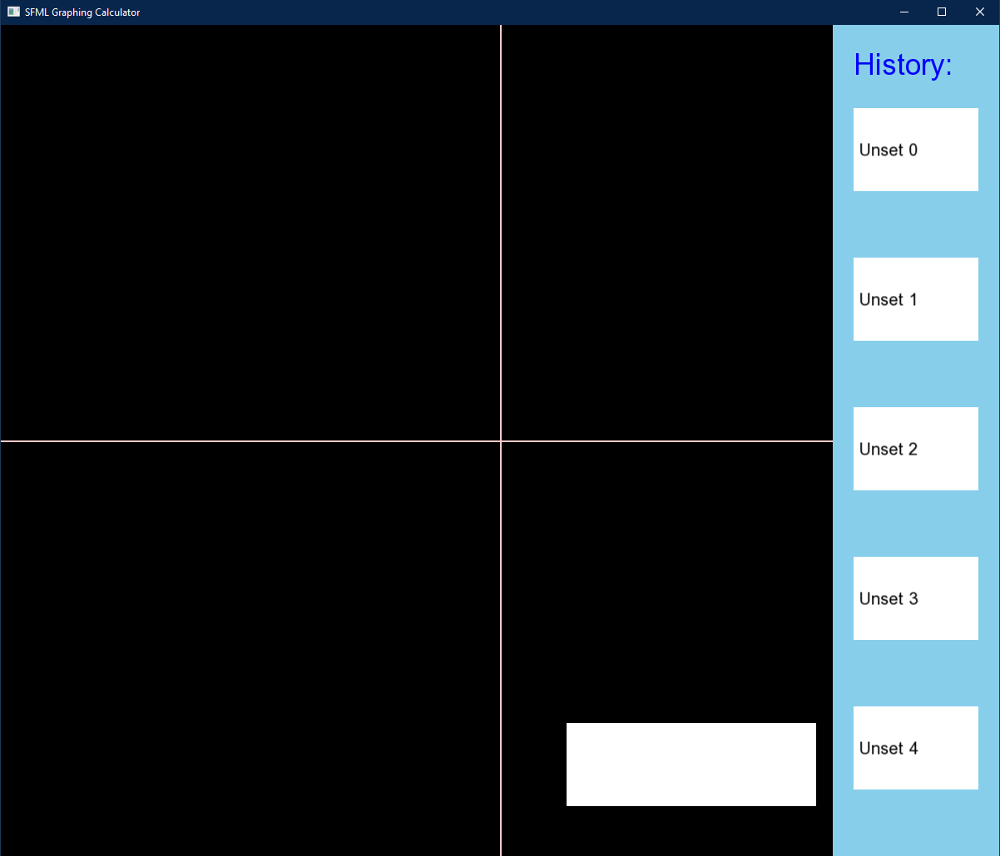

# SFML Graphing Calculator in C++

Embrace the power of computational mathematics with this Graphing Calculator, developed using C++ and SFML. It supports a wide array of functions and operations including +, -, *, /, ^, as well as single variable 'x' implementation.

* Press 'Enter' to activate the input box, ready to receive your commands.
* Press 'Esc' to deselect the input box.
* Press 'UP' to graph your inputted function.
* Press 'DOWN' to clear the existing graph.
* Press 'RIGHT' to zoom into the screen for a closer view of the graph.
* Press 'LEFT' to zoom out of the screen for a broader view.
* Use the mouse to interact with the sidebar, which stores your past input history.

## Launch Instructions
* Using any C++ IDE, simply clone the project and run. It's that straightforward!
* Leverages the Fetch API, eliminating the need to download any environment.

## Demo

## Design
Can be found in
https://github.com/hskl18/Graphing_Calculator_SFML/blob/main/design.txt

## Features

- Capability of graphing various functions
- Past history sidebar that combines with LRU cache
- Zoom in/zoom out
- Decimal value input such as 0.5 and 3.14
- Error handling for invalid input
- Unary operator for number such as -3.14 and -5
- User input string parsed into tokens, used Shunting Yard and RPN algorithms to evaluate into points
- Random Color generator to generate different colors for graph

